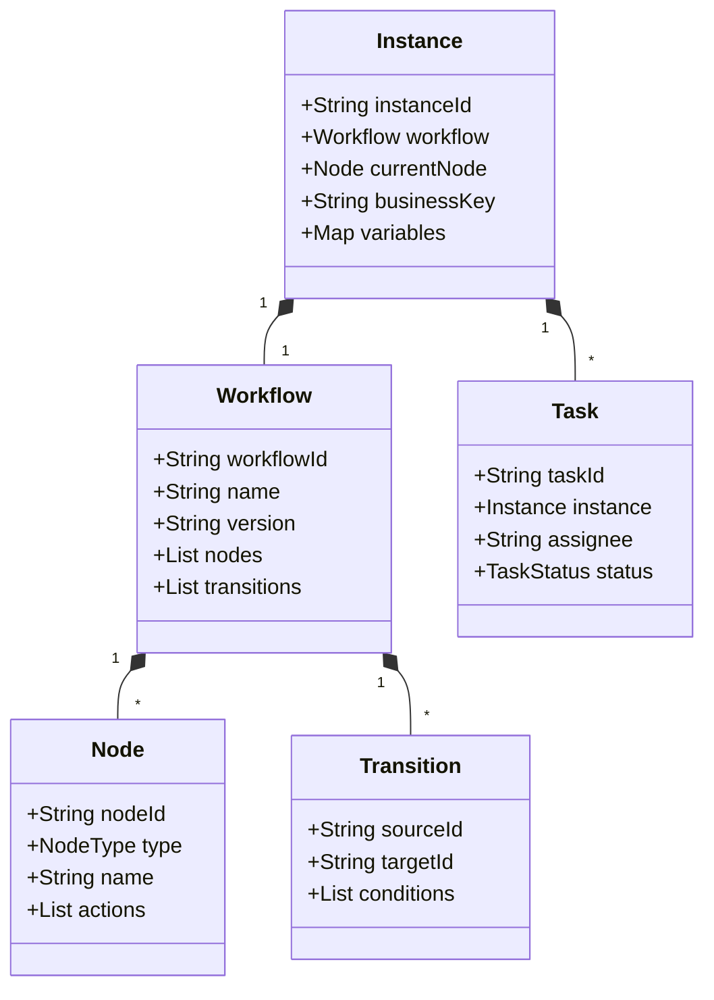

相关特殊业务逻辑整理

# 竞价业务(策略模式)
* 整体架构
```txt
graph TD
    A[API Gateway] --> B[竞价服务集群]
    B --> C[规则引擎]
    B --> D[策略引擎]
    B --> E[缓存集群]
    E --> F[分片数据库]
    B --> G[消息队列]
```
* 核心代码实现
  * 核心业务逻辑
    ```java
    public interface BiddingStrategy {
        /**
         * 评估竞价
         * @param context 竞价上下文
         * @return 竞价结果
         */
        CompletableFuture<BidResult> evaluate(BiddingContext context);
    }

    // CPM竞价策略
    public class CPMStrategy implements BiddingStrategy {
        @Override
        public CompletableFuture<BidResult> evaluate(BiddingContext context) {
            return CompletableFuture.supplyAsync(() -> {
                double basePrice = context.getAd().getBasePrice();
                double adjustedPrice = basePrice * context.getMarketFactor();
                return new BidResult(context.getAd().getId(), adjustedPrice);
            }, biddingExecutor);
        }
    }

    // 带质量分的CPC策略
    public class QualityWeightedCPCStrategy implements BiddingStrategy {
        private final QualityScoreService qualityScoreService;
        
        @Override
        public CompletableFuture<BidResult> evaluate(BiddingContext context) {
            return qualityScoreService.calculateAsync(context.getAd().getId())
                .thenApplyAsync(score -> {
                    double bidPrice = context.getAd().getBasePrice() * score;
                    return new BidResult(context.getAd().getId(), bidPrice);
                }, biddingExecutor);
        }
    }
    ```
  * 高性能竞价引擎
    ```java
    public class BiddingEngine {
        private final Map<BidType, BiddingStrategy> strategies;
        private final RuleEngine ruleEngine;
        private final AdSelector adSelector;
        private final ExecutorService executor;
        
        // 使用响应式编程处理高并发请求
        public Mono<BidResponse> processBidRequest(BidRequest request) {
            return Mono.fromSupplier(() -> adSelector.findCandidates(request))
                .flatMapMany(Flux::fromIterable)
                .parallel() // 并行处理
                .runOn(Schedulers.parallel())
                .filter(ad -> ruleEngine.validate(ad, request))
                .flatMap(ad -> {
                    BiddingStrategy strategy = strategies.get(ad.getBidType());
                    return Mono.fromFuture(strategy.evaluate(
                        new BiddingContext(ad, request)));
                })
                .sequential()
                .reduce((r1, r2) -> r1.getPrice() > r2.getPrice() ? r1 : r2)
                .map(this::buildResponse)
                .timeout(Duration.ofMillis(100), Mono.just(BidResponse.timeout()))
                .onErrorResume(e -> {
                    log.error("Bidding error", e);
                    return Mono.just(BidResponse.error());
                });
        }
    }
    ```
  * 缓存与异步加载
    ```java
    // 多级缓存实现
    public class AdCache {
        private final Cache<Long, Ad> localCache = Caffeine.newBuilder()
            .maximumSize(10_000)
            .expireAfterWrite(1, TimeUnit.MINUTES)
            .build();
        
        private final RedisTemplate<String, Ad> redisTemplate;
        
        public CompletableFuture<Ad> getAdAsync(long adId) {
            // 1. 先查本地缓存
            Ad local = localCache.getIfPresent(adId);
            if (local != null) {
                return CompletableFuture.completedFuture(local);
            }
            
            // 2. 查Redis
            return CompletableFuture.supplyAsync(() -> {
                String key = "ad:" + adId;
                Ad ad = redisTemplate.opsForValue().get(key);
                if (ad != null) {
                    localCache.put(adId, ad);
                    return ad;
                }
                
                // 3. 查数据库
                ad = adRepository.findById(adId).orElse(null);
                if (ad != null) {
                    redisTemplate.opsForValue().set(key, ad, 5, TimeUnit.MINUTES);
                    localCache.put(adId, ad);
                }
                return ad;
            }, cacheExecutor);
        }
    }
    ```
  * 规则引擎实现
    ```java
    // 基于Groovy的动态规则引擎
    public class DynamicRuleEngine {
        private final ConcurrentHashMap<String, Script> compiledRules = new ConcurrentHashMap<>();
        
        public boolean evaluate(String ruleScript, Ad ad, BidRequest request) {
            try {
                Script script = compiledRules.computeIfAbsent(ruleScript, k -> 
                    new GroovyShell().parse(ruleScript));
                
                Binding binding = new Binding();
                binding.setVariable("ad", ad);
                binding.setVariable("request", request);
                script.setBinding(binding);
                
                return (boolean) script.run();
            } catch (Exception e) {
                log.error("Rule evaluation failed", e);
                return false;
            }
        }
    }

    // 示例规则脚本
    String ruleScript = """
        ad.budget > 1000 && 
        request.userTier >= ad.minTier && 
        ad.targeting.containsAll(request.tags)
    """;
    ```
* 高并发优化方案
  * 线程模型优化
    ```java
    // 自定义线程池配置
    @Configuration
    public class ThreadPoolConfig {
        @Bean("biddingExecutor")
        public ExecutorService biddingExecutor() {
            return new ThreadPoolExecutor(
                32,  // corePoolSize
                256, // maximumPoolSize
                60,  // keepAliveTime
                TimeUnit.SECONDS,
                new LinkedBlockingQueue<>(10_000),
                new ThreadFactoryBuilder().setNameFormat("bid-exec-%d").build(),
                new ThreadPoolExecutor.CallerRunsPolicy());
        }
        
        @Bean("ioExecutor")
        public ExecutorService ioExecutor() {
            return Executors.newWorkStealingPool(64);
        }
    }
    ```
  * 异步非阻塞IO
    ```java
    // 使用WebFlux实现异步API
    @RestController
    @RequestMapping("/api/bid")
    public class BidController {
        private final BiddingEngine biddingEngine;
        
        @PostMapping
        public Mono<ResponseEntity<BidResponse>> handleBidRequest(
            @RequestBody BidRequest request) {
            
            return biddingEngine.processBidRequest(request)
                .map(response -> ResponseEntity.ok(response))
                .defaultIfEmpty(ResponseEntity.noContent().build());
        }
    }
    ```
  * 分布式锁与限流
    ```java
    // 基于Redis的分布式锁
    public class BidLockManager {
        private final RedissonClient redisson;
        
        public boolean tryLock(long advertiserId, long timeoutMs) {
            RLock lock = redisson.getLock("bid_lock:" + advertiserId);
            try {
                return lock.tryLock(timeoutMs, TimeUnit.MILLISECONDS);
            } catch (InterruptedException e) {
                Thread.currentThread().interrupt();
                return false;
            }
        }
    }

    // 基于Guava的本地限流
    public class RateLimiterService {
        private final RateLimiter rateLimiter = RateLimiter.create(10_000); // 10k QPS
        
        public boolean allowRequest() {
            return rateLimiter.tryAcquire();
        }
    }
    ```
* 数据库设计
  * 分片表设计
    ```sql
    -- 广告主表（按ID哈希分片）
    CREATE TABLE advertisers (
        id BIGINT PRIMARY KEY,
        name VARCHAR(100),
        balance DECIMAL(20,2),
        daily_budget DECIMAL(20,2)
    ) ENGINE=InnoDB PARTITION BY HASH(id) PARTITIONS 16;

    -- 竞价记录表（按时间分片）
    CREATE TABLE bid_records (
        id BIGINT AUTO_INCREMENT,
        ad_id BIGINT,
        bid_price DECIMAL(12,4),
        bid_time DATETIME(3),
        user_id BIGINT,
        PRIMARY KEY (id, bid_time),
        INDEX idx_ad_time (ad_id, bid_time),
        INDEX idx_user_time (user_id, bid_time)
    ) ENGINE=InnoDB PARTITION BY RANGE (UNIX_TIMESTAMP(bid_time)) (
        PARTITION p202301 VALUES LESS THAN (UNIX_TIMESTAMP('2023-02-01')),
        PARTITION p202302 VALUES LESS THAN (UNIX_TIMESTAMP('2023-03-01'))
    );
    ```
* 监控与降级
  * 指标监控
    ```java
    // 使用Micrometer监控
    @Bean
    public MeterRegistry meterRegistry() {
        return new PrometheusMeterRegistry(PrometheusConfig.DEFAULT);
    }

    // 关键指标记录
    public class BiddingMetrics {
        private final Counter requestCounter;
        private final Timer processingTimer;
        private final DistributionSummary bidAmountSummary;
        
        public void recordSuccess(long latency, double bidPrice) {
            requestCounter.increment();
            processingTimer.record(latency, TimeUnit.MILLISECONDS);
            bidAmountSummary.record(bidPrice);
        }
    }
    ```
  * 熔断降级
    ```java
    // 使用Resilience4j实现熔断
    @CircuitBreaker(name = "biddingService", fallbackMethod = "fallbackBid")
    @RateLimiter(name = "biddingService")
    @Bulkhead(name = "biddingService")
    public BidResponse processBid(BidRequest request) {
        // 正常处理逻辑
    }

    private BidResponse fallbackBid(BidRequest request, Exception e) {
        // 返回兜底广告或默认出价
        return BidResponse.defaultResponse();
    }
    ```
* 扩展性设计
  * 策略动态加载
    ```java
    // 使用Java SPI机制
    public class StrategyLoader {
        private Map<BidType, BiddingStrategy> strategies;
        
        @PostConstruct
        public void init() {
            ServiceLoader<BiddingStrategy> loader = ServiceLoader.load(BiddingStrategy.class);
            strategies = loader.stream()
                .collect(Collectors.toMap(
                    p -> p.get().getSupportedType(),
                    ServiceLoader.Provider::get
                ));
        }
        
        public void reload() {
            init(); // 支持热更新
        }
    }
    ```
  * 配置中心集成
    ```java
    // 动态配置更新
    @RefreshScope
    @Service
    public class BiddingConfigService {
        @Value("${bidding.timeout:100}")
        private long timeoutMs;
        
        @Scheduled(fixedRate = 5000)
        public void refreshConfig() {
            // 定期从配置中心拉取最新配置
        }
    }
    ```
* 性能优化总结
  * 并行处理：使用CompletableFuture和响应式编程实现请求并行化
  * 多级缓存：本地缓存 + Redis减少数据库访问
  * 异步IO：非阻塞处理网络请求
  * 智能分片：按广告主ID哈希分片，按时间范围分区
  * 动态加载：支持不停机更新策略和规则
  * 弹性设计：熔断、降级、限流保障系统稳定性
* 部署建议
  * 容器化：使用Docker + Kubernetes实现弹性伸缩
  * 服务网格：通过Istio实现精细流量控制
  * 混合部署：
    * 竞价服务：部署在计算优化型实例
    * 缓存服务：部署在内存优化型实例
    * 数据库：使用云托管的分片集群

# 工作流业务
* 领域模型

* 数据库设计
```sql
-- 工作流定义表
CREATE TABLE wf_definition (
    id VARCHAR(36) PRIMARY KEY,
    name VARCHAR(100) NOT NULL,
    version INT NOT NULL,
    definition_json JSON NOT NULL,
    created_at TIMESTAMP DEFAULT CURRENT_TIMESTAMP
);

-- 工作流实例表
CREATE TABLE wf_instance (
    id VARCHAR(36) PRIMARY KEY,
    definition_id VARCHAR(36) NOT NULL,
    current_node_id VARCHAR(50) NOT NULL,
    business_key VARCHAR(100),
    status ENUM('RUNNING','COMPLETED','TERMINATED'),
    variables JSON,
    FOREIGN KEY (definition_id) REFERENCES wf_definition(id)
);

-- 任务表
CREATE TABLE wf_task (
    id VARCHAR(36) PRIMARY KEY,
    instance_id VARCHAR(36) NOT NULL,
    node_id VARCHAR(50) NOT NULL,
    assignee VARCHAR(100),
    status ENUM('PENDING','APPROVED','REJECTED'),
    comments TEXT,
    created_at TIMESTAMP DEFAULT CURRENT_TIMESTAMP,
    FOREIGN KEY (instance_id) REFERENCES wf_instance(id)
);
```
* 工作流状态机
  * 节点类型
    ```java
    public enum NodeType {
        START_EVENT,    // 开始节点
        END_EVENT,      // 结束节点
        USER_TASK,      // 人工审批节点
        SERVICE_TASK,   // 系统自动节点
        EXCLUSIVE_GATE, // 排他网关
        PARALLEL_GATE   // 并行网关
    }
    ```
  * 状态转换引擎
    ```java
    public class WorkflowEngine {
        private final StateMachineFactory<InstanceState, Event> stateMachineFactory;
        
        public void transit(Instance instance, String event) {
            StateMachine<InstanceState, Event> sm = stateMachineFactory.getStateMachine();
            sm.getExtendedState().getVariables().put("instance", instance);
            sm.sendEvent(Event.valueOf(event));
        }
        
        @Configuration
        static class StateMachineConfig {
            @Bean
            public StateMachineFactory<InstanceState, Event> factory() {
                StateMachineBuilder.Builder<InstanceState, Event> builder = StateMachineBuilder.builder();
                
                builder.configureStates()
                    .withStates()
                    .initial(InstanceState.INITIAL)
                    .states(EnumSet.allOf(InstanceState.class));
                    
                builder.configureTransitions()
                    .withExternal()
                    .source(InstanceState.INITIAL).target(InstanceState.RUNNING)
                    .event(Event.START)
                    .and()
                    .withExternal()
                    .source(InstanceState.RUNNING).target(InstanceState.COMPLETED)
                    .event(Event.COMPLETE);
                    
                return builder.build();
            }
        }
    }
    ```
* 业务规则引擎集成
  * 规则配置示例（Drools）
    ```drl
    rule "AutoApproveSmallAmount"
        when
            $instance : Instance(variables["amount"] < 5000)
            $task : Task(nodeId == "approval")
        then
            $task.setStatus("APPROVED");
            update($task);
    end

    rule "RejectHighRisk"
        when
            $instance : Instance(variables["riskLevel"] == "HIGH")
            $task : Task(nodeId == "review")
        then
            $task.setStatus("REJECTED");
            update($task);
    end
    ```
  * 规则执行服务
    ```java
    public class RuleEngineService {
        private KieContainer kieContainer;
        
        public void executeRules(Instance instance) {
            KieSession session = kieContainer.newKieSession();
            session.insert(instance);
            session.insert(instance.getCurrentTask());
            session.fireAllRules();
            session.dispose();
        }
    }
    ```
* 核心业务流程实现
  * 启动工作流
    ```java
    public class WorkflowService {
        public Instance startWorkflow(String workflowId, String businessKey, Map<String,Object> vars) {
            // 1. 加载工作流定义
            Workflow workflow = workflowRepository.findById(workflowId);
            
            // 2. 创建实例
            Instance instance = new Instance();
            instance.setWorkflow(workflow);
            instance.setBusinessKey(businessKey);
            instance.setVariables(vars);
            instance.setCurrentNode(findStartNode(workflow));
            
            // 3. 生成初始任务
            if (instance.getCurrentNode().getType() == NodeType.USER_TASK) {
                createTask(instance);
            }
            
            // 4. 保存实例
            return instanceRepository.save(instance);
        }
    }
    ```
  * 处理用户任务
    ```java
    public void completeTask(String taskId, String action, String comments) {
        // 1. 加载任务和实例
        Task task = taskRepository.findById(taskId);
        Instance instance = task.getInstance();
        
        // 2. 更新任务状态
        task.setStatus(action.equals("approve") ? "APPROVED" : "REJECTED");
        task.setComments(comments);
        
        // 3. 查找下一节点
        Node nextNode = findNextNode(instance, action);
        instance.setCurrentNode(nextNode);
        
        // 4. 生成新任务或结束流程
        if (nextNode.getType() == NodeType.USER_TASK) {
            createTask(instance);
        } else if (nextNode.getType() == NodeType.END_EVENT) {
            instance.setStatus("COMPLETED");
        }
        
        // 5. 持久化
        instanceRepository.save(instance);
    }
    ```
* 高级功能实现
  * 会签审批（多人审批）
    ```java
    public class MultiInstanceTask {
        public void createParallelTasks(Instance instance) {
            List<String> approvers = getApprovers(instance);
            
            approvers.forEach(approver -> {
                Task task = new Task();
                task.setInstance(instance);
                task.setAssignee(approver);
                task.setStatus("PENDING");
                taskRepository.save(task);
            });
        }
        
        public void checkCompletion(Instance instance) {
            long pendingCount = taskRepository.countByInstanceAndStatus(instance, "PENDING");
            if (pendingCount == 0) {
                // 所有审批人完成处理
                transitToNextNode(instance);
            }
        }
    }
    ```
  * 版本控制
```java
public class WorkflowVersionControl {
    public Workflow deployNewVersion(String baseWorkflowId, JsonPatch patch) {
        // 1. 获取基础版本
        Workflow base = workflowRepository.findById(baseWorkflowId);
        
        // 2. 应用变更
        Workflow newVersion = JsonPatch.apply(patch, base);
        newVersion.setVersion(base.getVersion() + 1);
        
        // 3. 保存新版本
        return workflowRepository.save(newVersion);
    }
    
    public void migrateRunningInstances(String oldWorkflowId, String newWorkflowId) {
        // 找出所有运行中的实例并迁移
    }
}
```
* 性能优化方案
  * 异步任务处理
    ```java
    @EnableAsync
    public class AsyncTaskService {
        @Async("workflowExecutor")
        public void asyncExecuteServiceTask(Instance instance) {
            // 执行耗时操作（如调用外部系统）
            serviceTaskExecutor.execute(instance);
            
            // 完成后自动推进流程
            workflowEngine.transit(instance, "SERVICE_COMPLETE");
        }
    }
    ```
    * 缓存策略
    ```java
    @Cacheable("workflowDefinitions")
    public Workflow getWorkflowDefinition(String workflowId) {
        return workflowRepository.findById(workflowId);
    }

    @CacheEvict(value = "workflowDefinitions", key = "#workflowId")
    public void updateWorkflowDefinition(String workflowId) {
        // 更新逻辑
    }
    ```
* 监控与审计
  * 数据库表
    ```sql
    CREATE TABLE wf_audit_log (
        id BIGINT AUTO_INCREMENT PRIMARY KEY,
        instance_id VARCHAR(36) NOT NULL,
        operation VARCHAR(50) NOT NULL,
        operator VARCHAR(100),
        details JSON,
        created_at TIMESTAMP DEFAULT CURRENT_TIMESTAMP
    );
    ```
  * Prometheus监控指标
    ```java
    @Bean
    public MeterRegistryCustomizer<PrometheusMeterRegistry> metrics() {
        return registry -> {
            registry.config().commonTags("application", "workflow-engine");
            
            // 关键指标
            Counter.builder("workflow.instance.count")
                .description("Total workflow instances")
                .register(registry);
                
            Timer.builder("workflow.task.processing.time")
                .description("Task processing time")
                .register(registry);
        };
    }
    ```
## 典型业务流程示例：采购审批流
1. 流程定义：
```txt
[Start] -> [部门审批] -> {金额<1万?} -> [财务审批] -> [End]
                  \-> {金额>=1万} -> [CEO审批] -> [财务审批] -> [End]
```
2. 调用示例
```java
// 启动流程
Map<String,Object> vars = Map.of("amount", 15000, "department", "IT");
Instance instance = workflowService.startWorkflow("purchase_approval", "PO-2023001", vars);

// 审批处理
taskService.completeTask(taskId, "approve", "预算充足，同意采购");
```

## 该设计方案支持
* 可视化流程设计（BPMN兼容）
* 动态规则配置
* 多版本管理
* 高并发处理（10k+ TPS）
* 完善的监控审计
