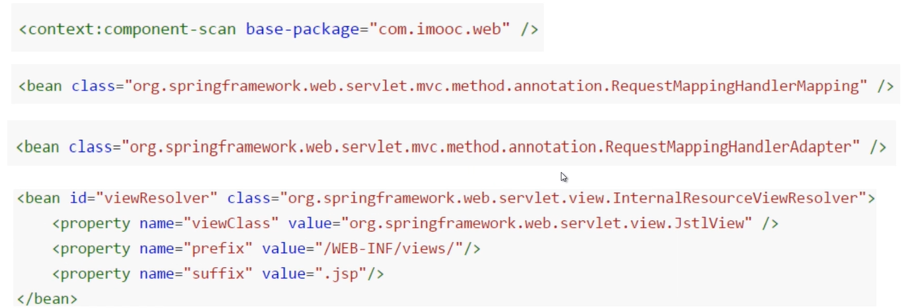
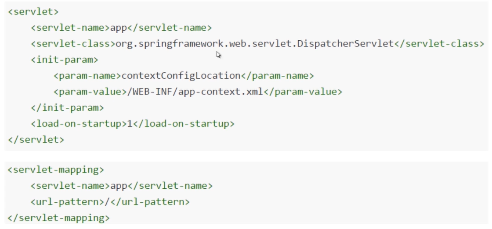
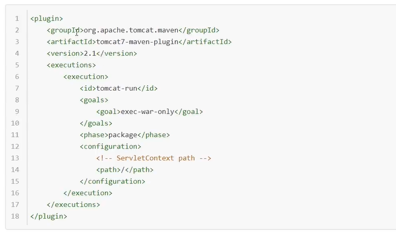
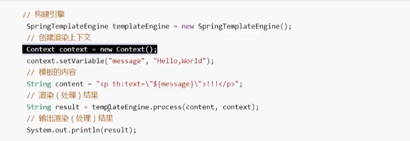

# Spring Framework Web MVC

## Web MVC组件配置



## 部署DispatcherServlet


## 依赖
* org.springframework:spring-webmvc
* javax.servlet:servlet-api
* javax.servlet: jstl

## 可执行插件


## Thymeleaf 模板引擎


# 功能
## 跨域处理

```java
import org.springframework.stereotype.Component;

import javax.servlet.*;
import javax.servlet.http.HttpServletResponse;
import java.io.IOException;

@Component
public class CORSConfig implements Filter {

    @Override
    public void doFilter(ServletRequest request, ServletResponse response, FilterChain chain) throws IOException, ServletException {
        HttpServletResponse res = (HttpServletResponse) response;
        res.setHeader("Access-Control-Allow-Origin", "*");
        res.setHeader("Access-Control-Allow-Methods", "POST, GET, OPTIONS, DELETE");
        res.setHeader("Access-Control-Max-Age", "3600");
        res.setCharacterEncoding("utf-8");
        res.setContentType("text/html; charset=utf-8");
        res.setHeader("Access-Control-Allow-Headers", "Content-Type,x-requested-with,token");
        chain.doFilter(request,response);
    }
}
```

## 异常统一处理

```java
import com.ad.adx.manage.model.AdmResponse;
import com.ad.adx.manage.utils.AdmException;
import com.ad.adx.manage.utils.AdmResponseUtil;
import org.slf4j.Logger;
import org.slf4j.LoggerFactory;
import org.springframework.web.bind.annotation.ControllerAdvice;
import org.springframework.web.bind.annotation.ExceptionHandler;
import org.springframework.web.bind.annotation.ResponseBody;

import javax.servlet.http.HttpServletRequest;

@ControllerAdvice
public class AdmExceptionHandler{

    private static final Logger LOGGER = LoggerFactory.getLogger("AdmExceptionHandler");

    @ExceptionHandler(value = Exception.class)
    @ResponseBody
    public AdmResponse exceptionHandler(HttpServletRequest req,Exception ex){
        LOGGER.error(ex.getMessage(),ex);
        if (ex instanceof AdmException){
            return AdmResponseUtil.error(ex.getMessage());
        }else{
            return AdmResponseUtil.error("请求异常，联系技术排查！");
        }
    }
}
```
